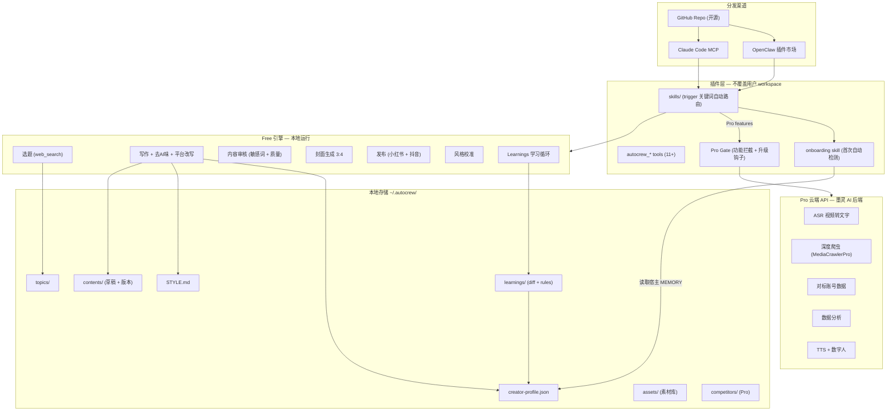
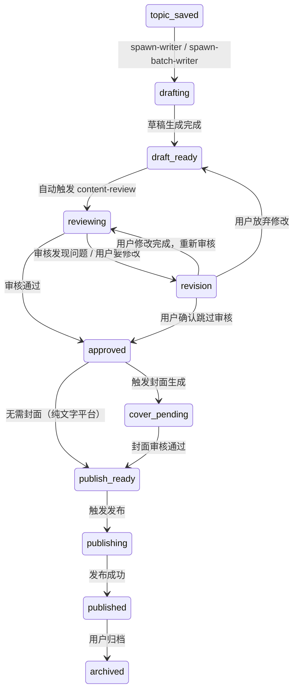

# AutoCrew 完整产品架构与 PRD v2 (Final)

## 一、产品定位与形态

AutoCrew 是面向中文新媒体创作者的 AI 数字员工。它是一个独立的开源项目（GitHub repo），同时也是 OpenClaw 插件和 Claude Code MCP server。

用户使用方式：

- OpenClaw 用户：`openclaw plugin install autocrew` → 一键安装，在 OpenClaw 里直接用
- Claude Code 用户：`git clone` → 配置 MCP server → 在 Claude Code 里用
- 其他 AgentOS 用户：`git clone` → 把 skills/ 复制到自己的 workspace

产品分层：

- Free 版：完整工作流 + 小红书 + 抖音（纯公开搜索，零爬虫，零法律风险）
- Pro 版：全平台 + 深度爬取 + 对标账号 + 数据分析 + 数字人/配音 + 多比例封面

与墨灵 AI 的关系：

- AutoCrew = 唯一面向用户的品牌（开源获客）
- 墨灵 AI = AutoCrew Pro 的云端 API 后端（不再独立推广）
- skills 和方法论共享，交付层分离
- Pro 版商业模式：用户本地跑免费功能，高级功能调墨灵 AI 云端 API（ASR、爬虫、数据分析、数字人）

---

## 二、安装体验设计（纯插件模式，不覆盖用户 workspace）

### 2.1 核心原则

AutoCrew 作为插件，不生成也不覆盖用户已有的 workspace 文件（AGENTS.md、MEMORY.md 等）。原因：

- 用户的 OpenClaw/Claude Code 已经有自己的 workspace 配置
- 用户可能已经做过风格校准、有自己的 MEMORY.md
- IM 通道（飞书/Telegram/Discord）是宿主 AgentOS 的事，插件不管

### 2.2 安装后发生什么

```
openclaw plugin install autocrew
```

插件注册：

- 注册 11+ 个 autocrew_* tools
- 注册 skills/ 目录下的所有 skill（每个 skill 自带 trigger 关键词）
- 创建 `~/.autocrew/` 数据目录（如果不存在）

不会生成：AGENTS.md、SOUL.md、CREW.md、BOOTSTRAP.md — 这些都不需要。

### 2.3 首次使用体验（onboarding skill，替代 BOOTSTRAP.md）

不用独立的引导文件，而是一个 `onboarding` skill，在用户首次触发任何 AutoCrew 功能时自动检测：

```
用户说"帮我找选题" → 触发 spawn-planner skill → 
skill 检测到 ~/.autocrew/creator-profile.json 不存在 →
自动进入 onboarding 流程：

Step 1: 从宿主读取已有信息
  → 读取宿主的 MEMORY.md（如果有行业、受众信息，直接复用）
  → 读取宿主的 memories（如果 AgentOS 支持）
  → 已有信息不再重复问

Step 2: 补问缺失信息（仅问必要的）
  → 如果缺行业："你主要做哪个领域的内容？"
  → 如果缺受众："你的目标读者是谁？"
  → 如果缺风格："发我 1-2 条你觉得写得好的内容"
  → 写入 ~/.autocrew/creator-profile.json 和 ~/.autocrew/STYLE.md

Step 3: 继续原始任务
  → onboarding 完成后，自动继续用户最初的请求（找选题）
```

优势：零配置文件冲突，渐进式收集信息，不打断用户意图。

### 2.4 深度风格校准（style-calibration skill）

从墨灵 AI 迁移的完整 4 阶段校准流程，适配本地插件场景：

- Phase 0: 品牌调研（2-4 轮对话，跳过已知信息）
- Phase 0.5: 受众画像生成（3 个 persona 选 1）
- Phase 1: 自由表达采集（用户提供内容样本）
- Phase 2: A/B 风格对比校准
- Phase 3: 写作人格生成 → 写入 `~/.autocrew/STYLE.md`
- Phase 4: 测试输出 3 个选题验证

触发方式：用户说"风格校准" / "校准" / "调风格"，或 onboarding 完成后 agent 主动建议

---

## 三、意图路由设计（Skill Trigger 模式，无独立路由文件）

不使用独立的 `CREW.md` 路由文件。每个 skill 的 SKILL.md 头部自带 trigger 关键词，OpenClaw 的插件机制自动匹配。

各 skill 的 trigger 定义：

```
onboarding          → 首次使用任何功能时自动触发（内部检测）
spawn-planner       → "找选题" / "调研" / "这周写什么"
topic-ideas         → "帮我想" / "想选题"
spawn-writer        → "写这个" / "帮我写"
spawn-batch-writer  → "都写了" / "批量写"
write-script        → 内部调用（由 spawn-writer 触发）
platform-rewrite    → "改写" / "适配" / "发到XX平台"
humanizer-zh        → "去AI味" / "润色"
content-review      → "审核" / "检查" / "敏感词"
cover-generator     → "封面" / "生成封面"
publish-content     → "发布" / "发到小红书"
style-calibration   → "风格校准" / "校准" / "调风格"
memory-distill      → 被动触发（用户反馈时）
manage-pipeline     → "自动化" / "定时"
asset-tagger        → "素材" / "扫描素材"

[Pro] competitor-monitor    → 用户发送创作者主页链接 / "对标" / "监控"
[Pro] extract-video-script  → 用户发送视频链接
[Pro] video-analysis        → 用户发送视频链接 + "分析/拆解"
[Pro] analytics-report      → "数据" / "分析报告"
```

Pro gate 逻辑：标记为 [Pro] 的 skill 在 Free 版触发时，返回功能介绍 + Free 版替代方案 + 升级提示。

---

## 四、对标账号功能（从墨灵 AI 迁移 + 增强）

### 4.1 短视频文案提取（Pro）

从墨灵 AI 迁移 `extract-video-script` skill：

- 用户发送抖音/小红书视频链接
- 调用墨灵 AI 云端 ASR 服务（SiliconFlow SenseVoice）转文字
- 返回完整文案 + 结构分析（hook/body/CTA 拆解）
- 提供后续动作：存为选题 / 改写为原创 / 分析结构

Free 版替代方案：用户手动粘贴文案文本，agent 帮分析结构和改写。

### 4.2 对标账号分析与监控（Pro，新增）

新增 `competitor-monitor` skill，从墨灵 AI 的 QINGMO.md Rule #1 + account-analyst + data-analyst 整合：

```
功能：
1. 添加对标账号：用户发送创作者主页链接 → 调 Pro API 抓取画像 → 存入 creator-profile.json
2. 定期监控：cron 任务调 Pro API 抓取对标账号最新内容
3. 竞品报告：分析发布频率、爆款率、内容主题分布、风格变化
4. 选题联动：将竞品热门内容自动注入选题池（标记来源）

存储：
~/.autocrew/competitors/
  ├── index.json              # 对标账号列表
  └── snapshots/              # 定期快照数据

Pro API 后端（墨灵 AI 提供）：
  POST /api/pro/competitor/profile   → MediaCrawlerPro 抓取创作者画像
  POST /api/pro/competitor/notes     → 抓取最新内容列表
  POST /api/pro/transcribe           → ASR 视频转文字
```

### 4.3 Free 版的升级钩子设计

用 agent 对话中的自然提示，不用前端 banner：

```
钩子 1 — 路由拦截型：
  用户发视频链接 → agent 识别意图 →
  "视频文案提取是 Pro 版功能。你可以手动复制文案给我，我来帮你分析结构和改写。
   了解 Pro 版：autocrew upgrade"

钩子 2 — 能力边界型：
  选题调研完成后 → agent 主动说：
  "这 3 个选题是从公开搜索找到的。Pro 版可以直接爬取你的对标账号最新爆款，精准度更高。"

钩子 3 — 数据缺失型：
  用户问"我上条笔记表现怎么样" →
  "数据分析是 Pro 版功能。你可以手动告诉我数据，我会记录到你的创作者档案里优化下一篇。"

钩子 4 — 封面限制型：
  封面生成完 3:4 后 →
  "3:4 封面已生成。需要 16:9 和 4:3 版本？这是 Pro 版功能。"

钩子 5 — 平台限制型：
  用户说"发到公众号" →
  "Free 版支持小红书和抖音发布。公众号/视频号/B站是 Pro 版功能。"
```

原则：每个钩子都提供 Free 版的替代方案，让用户感受到价值差而非被限制。

---

## 五、选题引擎 Free vs Pro 重新设计

### Free 版选题（纯公开搜索）

```
数据源：
1. web_search（Google/Bing 公开搜索）
2. 用户手动输入的链接/截图/文本
3. MEMORY.md 中的行业关键词 + 受众画像

流程：
1. 读取 MEMORY.md 获取行业、受众、风格边界
2. 用 web_search 搜索行业热门话题、知乎热榜、微博热搜
3. 结合 STYLE.md 做风格校准过滤（排除不匹配的选题）
4. 爆款评分：标题吸引力 + 话题热度 + 与用户定位匹配度
5. 输出 3-5 个选题，每个带评分和角度建议
```

### Pro 版选题（深度爬取）

```
在 Free 基础上增加：
1. Browser CDP 爬取用户已登录平台的推荐流/搜索结果
2. 对标账号最新内容自动注入
3. TikHub API 获取平台热榜数据
4. 视频文案提取 → 结构分析 → 改写建议
```

TikHub 定位调整：不再作为 Free 版 fallback，而是 Pro 版的补充数据源之一。Free 版完全不依赖任何第三方爬虫 API。

---

## 六、内容审核流程（review = 敏感词 + 质量检查）

`autocrew review` 命令整合敏感词检测：

```
流程：
1. 敏感词扫描 → 标记命中词 + 建议替换
2. 平台合规检查（各平台特有的违禁词/限流词）
3. 去 AI 味检查（是否还有明显 AI 痕迹）
4. 质量评分（信息密度、hook 强度、CTA 清晰度）
5. 输出审核报告 + 一键修复建议
```

敏感词模块设计：

- 内置词库：`src/data/sensitive-words-builtin.json`（随插件发布）
- 用户自定义：`~/.autocrew/sensitive-words/custom.txt`
- 平台特定：按平台维护不同的限流词列表

---

## 七、Learnings 学习系统增强

从墨灵 AI 的 3 层记忆架构迁移，适配本地场景：

```
L1 — MEMORY.md（≤120 行）：每次会话注入，品牌/受众/偏好
L2 — creator-profile.json：结构化创作者画像
L3 — learnings/ 目录：详细修改记录和归档

增强点：
1. Diff 追踪：用户每次修改内容，记录 before/after diff
2. 模式识别：累积 5+ 次同类修改后，自动提炼为规则
   例：用户连续 3 次删掉"首先/其次/最后" → 规则："禁用顺序词"
3. 规则写入：提炼的规则写入 creator-profile.json 的 writing_rules 字段
4. 写作注入：write-script skill 读取 writing_rules，一稿成型
```

creator-profile.json 结构：

```json
{
  "industry": "...",
  "platforms": ["xhs", "douyin"],
  "audience_persona": { "name": "...", "age": "...", "pain_points": [] },
  "writing_rules": [
    { "rule": "禁用顺序词（首先/其次/最后）", "source": "auto_distilled", "confidence": 0.9 },
    { "rule": "每段不超过 3 行", "source": "user_explicit", "confidence": 1.0 }
  ],
  "style_boundaries": { "never": [], "always": [] },
  "competitor_accounts": [],
  "performance_history": []
}
```

---

## 八、目标架构图（最终版）




---

## 九、Free vs Pro 功能矩阵（最终版）

Free 版（完整工作流，零成本，零爬虫）：

- 选题调研：web_search 公开搜索 + 风格校准过滤 + 爆款评分
- 内容写作：Hook-Body-CTA-Title 结构化写作
- 去 AI 味：中文口语化处理
- 平台改写：小红书 + 抖音格式适配
- 内容审核：敏感词检测 + 平台合规 + 质量评分
- 封面生成：3:4 比例
- 发布：小红书 + 抖音（browser 自动化或 copy-paste）
- 风格校准：4 阶段深度校准
- 创作者 Profile + Learnings 学习循环
- 本地素材管理
- 流水线自动化（cron）

Pro 版（在 Free 基础上，调墨灵 AI 云端 API）：

- 深度爬取选题（browser CDP + TikHub）
- 对标账号监控 + 竞品报告
- 视频文案提取（ASR 转写）
- 视频结构分析
- 全平台支持（+公众号、视频号、B站）
- 数据分析 Agent + 阶段性建议
- 多比例封面（16:9、4:3）
- 数字人 A-roll + TTS 配音 + 音色克隆
- B-roll 素材匹配 + 云端同步

---

## 十、数据模型（最终版）

```
~/.autocrew/
├── creator-profile.json         # 结构化创作者画像（从宿主 MEMORY 初始化）
├── STYLE.md                     # 写作风格档案（风格校准生成）
├── topics/                      # 选题库
├── contents/                    # 内容项目（草稿 + 版本 + 素材）
├── learnings/                   # 学习系统
│   ├── edits/                   # 每次修改的 diff 记录
│   └── rules.json               # 自动提炼的写作规则
├── assets/                      # 素材库
│   ├── index.json               # 素材索引（多模态标签）
│   └── raw/                     # 原始素材文件
├── sensitive-words/             # 敏感词库
│   ├── builtin.txt              # 内置词库（随插件发布）
│   └── custom.txt               # 用户自定义
├── covers/                      # 封面模板和生成结果
│   └── templates/               # 个人 IP 模板
├── competitors/ (Pro)           # 对标账号数据
│   ├── index.json
│   └── snapshots/
├── analytics/ (Pro)             # 数据分析缓存
│   └── reports/
├── pipelines/                   # 流水线定义
├── memory/                      # 反馈归档 (JSONL)
└── .pro                         # Pro API key（如果已升级）
```

注意：不再有 MEMORY.md — 品牌记忆读取宿主 AgentOS 的 MEMORY.md，AutoCrew 自己的结构化数据存在 creator-profile.json。

---

## 十一、Pro 认证与计费机制

### 11.1 认证流程

```
用户在本地执行 autocrew upgrade →
  1. 打开浏览器跳转到 autocrew.dev/activate（或墨灵 AI 域名）
  2. 用户注册/登录 → 选择套餐 → 支付
  3. 获得 Pro API key
  4. 回到终端粘贴 key → 写入 ~/.autocrew/.pro
  5. 插件验证 key 有效性（GET /api/pro/verify）
  6. 激活成功，Pro 功能解锁
```

### 11.2 计费模式（混合制）

```
基础月费（解锁 Pro 功能入口）：
  - 包含每月 N 次基础调用额度（ASR、爬虫、数据分析各有配额）
  - 超出部分按次计费

按次计费项（超出基础配额后）：
  - ASR 视频转写：按分钟
  - 对标账号抓取：按次
  - 数据分析报告：按次
  - 数字人 A-roll：按秒
  - TTS 配音：按字数
  - 封面生成（多比例）：按张

复用墨灵 AI 已有基建：
  - Organization.plan（free/pro/enterprise）
  - TokenPackage + TokenTransaction + consume_tokens()
  - 新增：API key 生成和验证逻辑
```

### 11.3 降级策略

```
key 过期或余额不足时：
  1. Pro 功能不硬性报错，而是返回友好提示 + 续费链接
  2. 已生成的 Pro 数据（竞品快照、分析报告）仍可本地查看
  3. 自动降级到 Free 版功能（比如选题从深度爬取降级到 web_search）
  4. 本地缓存的 Pro 数据不删除，续费后继续可用
```

---

## 十二、Pro API 接口规范

### 12.1 认证方式

所有 Pro API 请求携带 header：`Authorization: Bearer <pro_api_key>`

### 12.2 接口列表

```
认证：
  GET  /api/pro/verify                    → 验证 key 有效性 + 返回配额余量

选题与爬虫：
  POST /api/pro/research/crawl            → browser CDP 深度爬取平台搜索结果
  POST /api/pro/research/trending         → 获取平台热榜数据（TikHub）

对标账号：
  POST /api/pro/competitor/profile        → 抓取创作者画像
  POST /api/pro/competitor/notes          → 抓取最新内容列表
  POST /api/pro/competitor/analyze        → 生成竞品分析报告

视频处理：
  POST /api/pro/transcribe                → ASR 视频转文字
  POST /api/pro/video/analyze             → 视频结构分析（hook/body/CTA）

数据分析：
  POST /api/pro/analytics/account         → 账号数据分析
  POST /api/pro/analytics/content         → 单条内容表现分析
  POST /api/pro/analytics/report          → 生成阶段性分析报告

封面：
  POST /api/pro/cover/generate            → 生成多比例封面（16:9、4:3）

数字人与配音：
  POST /api/pro/tts/synthesize            → TTS 配音
  POST /api/pro/tts/clone                 → 音色克隆
  POST /api/pro/digital-human/generate    → 数字人 A-roll 生成

通用：
  GET  /api/pro/usage                     → 查询当月用量和配额
```

### 12.3 后端精简方案

从墨灵 AI 后端保留：

- 认证服务（API key 生成/验证/配额管理）
- transcription.py（ASR 转写）
- media_crawler_bridge.py（爬虫桥接）
- token.py（计费逻辑）
- PostgreSQL（用户/配额/交易记录）

从墨灵 AI 后端移除：

- 前端相关路由（/api/v1/ 大部分）
- OpenClaw Gateway WebSocket 集成
- 飞书集成
- workspace 管理
- 内容/选题 CRUD（这些在本地 AutoCrew 处理）

### 12.4 限流策略

```
Free 版：Pro API 全部返回 403 + 升级提示
Pro 基础版：每分钟 10 次请求，每月配额内
Pro 超额：按次扣费，无速率限制变化
Enterprise：自定义配额 + 私有部署选项
```

---

## 十三、内容生命周期状态机

### 13.1 状态定义

```
topic_saved     → 选题已保存（来自调研或手动创建）
drafting        → 正在生成草稿
draft_ready     → 草稿完成，待审核
reviewing       → 审核中（敏感词 + 质量检查 + 去AI味）
revision        → 用户修改中（触发 diff 追踪）
approved        → 审核通过，待生成封面/素材
cover_pending   → 封面生成中
publish_ready   → 所有素材就绪，待发布
publishing      → 发布中（browser 自动化进行中）
published       → 已发布到平台
archived        → 已归档
```

### 13.2 状态流转图




### 13.3 自动触发规则

```
draft_ready → reviewing：自动运行，无需用户操作
  - 敏感词扫描
  - 去 AI 味检查
  - 质量评分
  - 如果全部通过 → 直接跳到 approved

revision → learnings：每次用户修改自动记录 diff
  - 写入 ~/.autocrew/learnings/edits/
  - 累积后触发规则提炼

approved → cover_pending：如果目标平台需要封面（小红书必须，抖音可选）
```

---

## 十四、多平台分发数据模型

### 14.1 关联关系

```
一个 topic → 多个 content（每个 content 绑定一个 platform）

topic-001/
  ├── topic.json                    # 选题元数据

contents/
  ├── content-001-xhs/              # 小红书版本
  │   ├── meta.json                 # { platform: "xhs", topicId: "topic-001", ... }
  │   ├── draft.md
  │   └── ...
  ├── content-001-douyin/           # 抖音版本
  │   ├── meta.json                 # { platform: "douyin", topicId: "topic-001", ... }
  │   ├── draft.md
  │   └── ...
  └── content-001-wechat-mp/        # 公众号版本 (Pro)
      ├── meta.json
      ├── draft.md
      └── ...
```

### 14.2 批量分发流程

```
用户说"这个选题发到小红书和抖音" →
  1. 从 topic 生成小红书版本（platform-rewrite skill）
  2. 从 topic 生成抖音版本（platform-rewrite skill）
  3. 每个版本独立走状态机（各自审核、各自生成封面）
  4. 各版本的标题和 hashtag 按平台独立生成
  5. 发布时各自调用对应平台的发布适配器
```

### 14.3 meta.json 扩展

```json
{
  "id": "content-001-xhs",
  "topicId": "topic-001",
  "platform": "xhs",
  "status": "draft_ready",
  "title": "...",
  "hashtags": ["#选题1", "#选题2"],
  "siblings": ["content-001-douyin", "content-001-wechat-mp"],
  "publishedAt": null,
  "publishUrl": null,
  "performanceData": {}
}
```

`siblings` 字段关联同一 topic 的其他平台版本，方便查看分发全貌。

---

## 十五、现有代码迁移计划

### 15.1 可直接复用（无需改动）

- `src/modules/humanizer/zh.ts` — 去 AI 味，纯函数
- `src/modules/writing/platform-rewrite.ts` — 平台改写，纯函数
- `src/modules/memory/distill.ts` — 记忆蒸馏（需小幅扩展 diff 追踪）
- `src/storage/local-store.ts` — 本地存储（需扩展新字段）
- `src/tools/content-save.ts` — 内容 CRUD
- `src/tools/topic-create.ts` — 选题 CRUD
- `src/tools/asset.ts` — 素材管理
- `src/tools/humanize.ts` — 去 AI 味工具入口
- `src/tools/rewrite.ts` — 平台改写工具入口
- `src/tools/cover-review.ts` — 封面评审
- `src/tools/memory.ts` — 记忆工具入口
- `src/tools/pipeline.ts` — 流水线管理
- `src/tools/status.ts` — 状态概览

### 15.2 需要重构

```
src/tools/research.ts
  现状：直接调用 browserCdpAdapter，Free 版不能用
  改为：Free 版走 web_search 路径，Pro 版走 browser CDP + TikHub
  新增：风格校准过滤 + 爆款评分逻辑

src/adapters/browser/browser-cdp.ts
  现状：Free 版默认使用
  改为：仅 Pro 版加载，Free 版不引入

src/adapters/research/tikhub.ts
  现状：placeholder
  改为：Pro 版真实实现，Free 版不引入

src/tools/publish.ts
  现状：仅支持微信公众号，依赖外部 Python 脚本
  改为：抽象为多平台发布接口，Free 版支持 XHS + 抖音

index.ts（OpenClaw 入口）
  新增：Pro gate 中间件（检测 .pro 文件，拦截 Pro 功能）
  新增：onboarding 检测逻辑

mcp/server.ts（Claude Code 入口）
  同步 index.ts 的变更
```

### 15.3 需要新增

```
src/modules/filter/sensitive-words.ts     — 敏感词过滤
src/modules/research/free-research.ts     — Free 版选题引擎
src/modules/research/topic-scorer.ts      — 爆款评分
src/modules/title/multi-platform.ts       — 多平台标题/Hashtag 生成
src/modules/learnings/diff-tracker.ts     — Diff 追踪
src/modules/learnings/rule-distiller.ts   — 规则提炼
src/modules/pro/api-client.ts             — Pro API 客户端
src/modules/pro/gate.ts                   — Pro 功能门控

src/tools/review.ts                       — 内容审核工具（整合敏感词）

src/data/sensitive-words-builtin.json     — 内置敏感词库

skills/onboarding/SKILL.md               — 首次引导
skills/content-review/SKILL.md           — 内容审核
skills/competitor-monitor/SKILL.md       — 对标账号 (Pro)
skills/extract-video-script/SKILL.md     — 视频文案提取 (Pro)
skills/video-analysis/SKILL.md           — 视频结构分析 (Pro)
skills/analytics-report/SKILL.md         — 数据分析 (Pro)
skills/cover-generator/SKILL.md          — 封面生成
skills/batch-distribute/SKILL.md         — 多平台批量分发
```

### 15.4 需要删除/移除

```
src/adapters/research/tikhub.ts 的 placeholder 假数据 → 替换为真实实现或移除
templates/AGENTS.md → 不再生成到用户 workspace（保留在 repo 作为参考）
templates/SOUL.md → 同上
templates/TOOLS.md → 同上
```

---

## 十六、测试策略

### 16.1 测试分层

```
单元测试（vitest）：
  - src/modules/ 下所有纯函数模块
  - humanizer/zh.ts（已有完整逻辑，优先补测试）
  - platform-rewrite.ts
  - sensitive-words.ts
  - diff-tracker.ts
  - rule-distiller.ts
  - topic-scorer.ts

集成测试：
  - src/tools/ 的 execute 函数（mock storage）
  - Pro gate 拦截逻辑
  - onboarding 检测流程
  - 内容状态机流转

端到端测试（手动 + 脚本）：
  - OpenClaw 插件安装 → onboarding → 选题 → 写作 → 审核 → 发布
  - Claude Code MCP 连接 → 基础工作流
  - Pro 升级 → Pro 功能调用 → 降级
```

### 16.2 测试优先级

```
P0（Phase 1 必须有）：
  - humanizer/zh.ts 单元测试
  - platform-rewrite.ts 单元测试
  - sensitive-words.ts 单元测试
  - local-store.ts 集成测试
  - Pro gate 逻辑测试

P1（Phase 2 补齐）：
  - 所有 tools 的集成测试
  - 状态机流转测试
  - diff-tracker + rule-distiller 测试

P2（持续补充）：
  - E2E 工作流测试
  - Pro API 集成测试
```

---

## 十七、实施路线图（更新版）

Phase 1 (P0) — Free 版核心闭环（目标：用户装完能跑通选题→写作→审核→发布）：

- autocrew init CLI（创建 ~/.autocrew/ 数据目录）
- onboarding skill（从宿主 MEMORY 读取 + 补问缺失信息）
- creator-profile.json 结构化 + 读写模块
- 重构 research tool（Free 版走 web_search + 风格校准过滤 + 爆款评分）
- 敏感词过滤模块 + content-review skill（整合到状态机 draft_ready→reviewing）
- 内容状态机实现（meta.json status 字段 + 自动流转）
- 多平台标题/Hashtag 独立生成模块
- 多平台分发数据模型（topic → 多 content，siblings 关联）
- Learnings 增强（diff 追踪 + 模式识别 + 规则提炼）
- 风格校准 skill 迁移（从墨灵 AI 适配本地）
- Pro gate 模块 + 5 种升级钩子埋点
- P0 单元测试（humanizer、platform-rewrite、sensitive-words、local-store）

Phase 2 (P1) — 素材与发布 + Pro API 上线：

- 素材多模态识别与打标
- 封面生成模块
- 抖音/小红书发布适配器（browser 自动化 + copy-paste fallback）
- 同主题多平台批量分发 skill
- Pro API 后端搭建（从墨灵 AI 精简，认证 + 计费 + 核心接口）
- 对标账号监控 skill (Pro)
- 视频文案提取 skill (Pro)
- TikHub 适配器真实实现 (Pro)
- P1 集成测试

Phase 3 (P2) — Pro 高级功能：

- 数据分析 Agent
- 数字人 A-roll + TTS 配音
- B-roll 素材匹配
- 多比例封面（16:9、4:3）
- 全平台发布支持（公众号、视频号、B站）