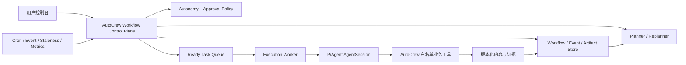

# AutoCrew PiAgent + Dynamic Workflow 架构 PRD

## 1. 决策

AutoCrew 的目标架构正式调整为：

> PiAgent 是 Agent Runtime，AutoCrew 是 Dynamic Workflow Control Plane。

AutoCrew 不再长期维护另一套独立 Agent 内核。模型、会话、工具调用、上下文压缩和会话树逐步迁移到 PiAgent；目标、任务图、状态、权限、审批、调度、产物版本和托管策略由 AutoCrew 掌握。

动态工作流不等于“让多个 Agent 自由聊天”。Agent 只能执行任务或提出结构化工作流变更，AutoCrew 负责验证、批准、持久化和调度。

## 2. 用户目标

### 2.1 必须支持

1. 用户可查看和控制整个工作流：
   - 查看目标、任务、依赖、Agent、输入、产物和执行历史；
   - 编辑、暂停、恢复、跳过、重试和终止；
   - 设置模型、工具、预算、渠道、频率和审批规则；
   - 对外发布、发消息、改网站、付费等动作保留人工门。
2. 用户忙时可把同一个工作流切换为托管模式：
   - 按时间、事件、内容过期或数据变化自动触发；
   - 自动研究、生产、审核、更新和复盘；
   - 进程或机器重启后可恢复；
   - 达到预算、失败和风险阈值时自动停止并通知用户。
3. 内容形成持续循环：
   - 监测信号；
   - 判断内容缺口或过期；
   - 研究和生成；
   - 审核与审批；
   - 发布或导出；
   - 收集表现；
   - 更新计划和内容。

### 2.2 非目标

- 不允许内容 Agent 默认获得 shell、任意文件系统或项目扩展权限。
- 不以 Agent 对话记录作为工作流事实源。
- 不让 LLM 绕过状态转换、审批和预算。
- 第一阶段不建设分布式微服务；先保持本地模块化单体和可替换端口。

## 3. 规模和可靠性假设

第一版按单用户或小团队设计：

- 20 个活跃工作流；
- 每个工作流每天 10 次调度周期；
- 每周期最多 5 个 Agent Run；
- 约 1,000 个 Run/天的上限；
- 每个 Run 元数据约 10 KB，产物平均 100 KB；
- 一年元数据约 4 GB、产物约 40 GB，单机 SQLite/文件存储足够。

托管运行目标：

- 同一任务最多一个有效执行租约；
- 至少一次投递，工具副作用通过幂等键收敛为一次；
- 本地托管 RPO 接近 0（原子落盘），进程恢复目标 RTO 小于 5 分钟；
- 云托管的可用性和多租户指标在进入云部署阶段单独定义。

## 4. 高层架构



### 4.1 PiAgent Runtime

职责：

- AgentSession 生命周期；
- 模型与 provider 接入；
- 会话持久化和压缩；
- 工具调用；
- Agent 事件流。

安全边界：

- `noTools: "all"`，只显式开启 AutoCrew 注入的工具；
- 禁止自动发现全局/项目 extensions、skills、prompts、themes 和 context files；
- API key 只通过进程内 credential store 注入；
- AgentSession 文件只能落在 AutoCrew `dataDir`；
- PiAgent 依赖精确锁版本，升级使用独立提交和契约测试。

### 4.2 Dynamic Workflow Control Plane

这是业务事实源，包含：

- Workflow Definition：目标、任务节点、依赖、条件和策略；
- Workflow Instance：当前状态、revision、触发器和执行游标；
- Task Run：尝试次数、租约、AgentSession、输入快照和结果；
- Artifact：产物版本、来源、使用的证据和上下游关系；
- Approval：风险动作、申请、决定和有效期；
- Workflow Event：所有计划和执行状态变化。

AgentSession JSONL 是运行上下文和审计资料，不是工作流事实源。两者漂移时，以 Workflow Store 为准；AgentSession 可重建或重新开始。

### 4.3 Planner / Replanner

Planner 生成初始计划；Replanner 在事件发生后提出结构化 `WorkflowPatch`。

允许的 Patch 类型：

- 新增任务；
- 修改尚未执行任务的说明、角色和渠道；
- 替换尚未执行任务的依赖；
- 取消尚未执行任务。

每个 Patch 必须包含：

- `baseRevision`；
- 原因；
- 提议者；
- 有限数量的操作；
- 创建时间。

AutoCrew 应用 Patch 前必须验证：

- revision 无并发冲突；
- 任务和角色合法；
- 依赖存在且无环；
- running/completed 任务不可变；
- Agent 不得移除既有风险审批；
- 操作数量、每日重规划次数和预算未超限。

### 4.4 Autonomy Policy

业务模式与自治模式是两个正交概念：

- `CampaignMode`：`personal` / `managed_growth`；
- `AutonomyMode`：`manual` / `supervised` / `managed`。

| 模式 | 任务执行 | 工作流 Patch | 外部副作用 |
|---|---|---|---|
| manual | 用户逐批或逐步启动 | 人工批准 | 人工批准 |
| supervised | 安全任务可自动运行 | 人工批准 | 人工批准 |
| managed | 安全任务和安全 Patch 自动运行 | 破坏性 Patch 人工批准 | 人工批准 |

自治模式是策略，不是另一套工作流。切换模式不会复制任务或产物。

## 5. 核心领域模型

```text
Campaign
├── brief
├── team
├── tasks[]
├── runs[]
├── artifacts[]
├── approvals[]
├── metrics[]
└── workflow
    ├── revision
    ├── autonomy
    ├── policy
    ├── schedule
    ├── patches[]
    └── events[]
```

### 5.1 任务状态

```text
pending -> ready -> running -> completed
              |         |
              |         -> failed -> ready (explicit retry)
              -> awaiting_approval -> ready
              -> cancelled
```

任务的状态只能由领域函数转换。LLM 不得直接提交状态字段。

### 5.2 执行租约

托管 Worker 领取任务时创建租约：

- `ownerId`；
- `leaseId`；
- `expiresAt`；
- `heartbeatAt`；
- `idempotencyKey`。

过期租约可回收。外部写工具必须使用 `taskId + runAttempt + action` 形成幂等键，避免 Worker 崩溃后的重复发布或付费。

### 5.3 产物更新

Artifact 不覆盖旧内容，而是产生新版本：

- `logicalContentId` 标识同一内容；
- `version` 递增；
- `supersedesArtifactId` 指向旧版；
- 保存证据快照、人工修改 diff 和发布表现。

内容过期触发器只创建更新任务，不直接覆盖已发布内容。

## 6. 运行循环

一次托管周期：

1. 获取到期 Trigger；
2. 对 Workflow Instance 获取短租约；
3. 读取新事件、指标和内容过期信号；
4. 必要时调用 Replanner 产生 Patch；
5. 由 Policy 决定自动应用或进入待审；
6. 领取有限数量 ready task；
7. 每个任务通过 PiAgent AgentSession 执行；
8. 原子写入 Run、Artifact 和 Workflow Event；
9. 解锁下游任务；
10. 评估目标、预算、失败阈值和下一次触发时间；
11. 释放租约。

循环必须有明确终止条件：

- 目标完成；
- deadline 到期；
- 每日/总预算耗尽；
- 连续失败超过阈值；
- 人工暂停；
- 需要审批且审批未完成。

## 7. 端口与依赖方向

领域层定义端口，外层实现：

```text
campaign/domain + workflow-engine
        ↑
campaign use cases / scheduler / replanner
        ↑
storage adapters / PiAgent adapter / IPC handlers
        ↑
desktop server / frontend / future hosted worker
```

核心端口：

- `AgentRuntime`：执行一个 Agent 任务；
- `WorkflowRepository`：读取和原子更新工作流；
- `ArtifactRepository`：版本化产物；
- `TriggerRepository`：查询和更新触发器；
- `ExecutionQueue`：领取任务和租约；
- `NotificationPort`：提醒审批、失败和预算耗尽。

PiAgent、JSON 文件、SQLite、Electron IPC 和未来云队列都属于可替换适配器。

## 8. 迁移计划

### Phase 1：架构边界和安全纵向切片

- [x] 引入与 `pi-ai` 同版本的 `pi-coding-agent`；
- [x] 建立 `AgentRuntime` 端口和封闭 PiAgent adapter；
- [x] 新增 autonomy、workflow revision、Patch 和事件模型；
- [x] Campaign 支持提出、批准、拒绝和安全应用 Patch；
- [x] UI 支持切换自治模式和处理待审 Patch。

### Phase 2：PiAgent 接管 Campaign Agent

- [x] Campaign 新任务默认走 PiAgent；
- [x] 现有 `runLoop` 保留为兼容 adapter；
- [x] Run 记录实际 runtime 和 AgentSession id；
- 为长任务启用持久 AgentSession；
- 对齐预算、run-log、看门狗和工具串行语义。

### Phase 3：动态 Replanner

- [x] Agent 根据目标、产物、指标和失败事件生成结构化 Patch；
- [x] managed 模式自动应用安全 Patch；
- 建立内容过期和表现下降的更新任务；
- 完成工作流时间线和版本 diff。

### Phase 4：无人值守 Worker

- [x] 增加本地服务在线期间的持久化周期 trigger；
- [x] supervised 自动执行安全 ready task，managed 在一轮完成后自动调用 Replanner；
- [x] Campaign 重启后从持久化 `nextRunAt`、`lastCycleAt` 和结果摘要恢复；
- 增加 lease、heartbeat、idempotency 和 crash recovery；
- 将当前本地 server host 升级为独立 daemon，再抽象 remote/cloud worker；
- 通知用户待审批、失败、暂停和预算耗尽。

### Phase 5：托管内容飞轮

- 接入发布和指标 connector；
- 建立内容 lineage、质量和效果反馈；
- 自动更新表现下降或事实过期的内容；
- 支持多工作流配额、SLA 和运营看板。

## 9. 风险与缓解

1. **PiAgent SDK 变化快**
   - 精确锁版本；
   - adapter 隔离；
   - 独立升级；
   - 真实 provider 契约测试。
2. **Agent 动态计划失控**
   - 结构化 Patch；
   - revision 和 DAG 校验；
   - 操作、频率和预算上限；
   - destructive patch 人工批准。
3. **重复副作用**
   - 至少一次投递；
   - 写工具使用幂等键；
   - provider call 重试不能重跑已成功工具。
4. **会话和工作流双事实源**
   - Workflow Store 是唯一业务事实源；
   - AgentSession 只保存上下文；
   - 用输入/输出快照关联两者。
5. **本地机器离线**
   - 本机后台托管只能承诺进程恢复；
   - 真正“用户电脑关闭仍运行”需要 always-on host 或云 Worker；
   - 两种部署复用同一 ExecutionQueue 和 WorkflowRepository 端口。
6. **依赖安全问题**
   - 禁止默认工具和资源发现；
   - 定期 `npm audit`；
   - 高风险传递依赖升级不得绕过 PiAgent 契约测试。
   - 当前锁定的 `pi-coding-agent@0.80.10` 自带 shrinkwrap，仍包含
     `brace-expansion@5.0.6`（high）和 `protobufjs@7.6.4`（moderate）。
     当前路径关闭 glob 资源发现且不启用 Google provider，降低可达性，但不把它们视为已修复；
     上游发布修复版后必须用独立依赖升级和全量契约测试消除。

## 10. 验收标准

Phase 1 完成的定义：

- 用户能在 UI 切换 manual/supervised/managed；
- Agent 或用户能提交结构化 Patch；
- 并发 revision、坏 ID、缺失依赖、循环依赖和修改已完成任务均被拒绝；
- manual/supervised 的 Patch 进入待审；
- managed 的安全 Patch 自动应用，取消任务等破坏性 Patch 仍待审；
- PiAgent session 默认没有 shell/read/write/edit 等内置工具；
- 所有现有测试保持通过并新增上述领域契约测试。

当前额外完成 Phase 2 和 Phase 3/4 的纵向切片：

- Campaign Task 默认通过封闭 PiAgent AgentSession 执行，旧 loop 仅作为兼容 adapter；
- 非 manual Campaign 可设置 1 小时、6 小时或每天的后台周期；
- AutoCrew 本地服务在线时按 `nextRunAt` 执行，且同一进程不会重入同一个 Campaign；
- supervised 只执行已批准的安全任务，不自动应用 Patch；
- managed 仅在任务全部完成、无失败、无待审批并已有产物时调用 PiAgent Replanner；
- 发布、发消息、付费、改站和导出客户数据仍停在审批门；
- 每轮结果和下次执行时间原子写回 Campaign，server 重启后继续。

这不是云托管：本地 server 停止或电脑关机期间不会执行，恢复在线后才处理到期周期。

## 11. 当前架构评分

- 决策与边界：8/10；
- 代码落地：8/10；
- 本地托管纵向切片：6/10；
- 可靠托管：4/10；
- 综合：7/10。

达到 10/10 还需要：Campaign Task 全量迁移到持久 AgentSession、跨进程租约与工具幂等、独立 daemon/云 Worker、版本化内容、发布指标闭环、通知和托管环境灾难恢复。
